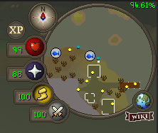

# Tick tracker

Tick Tracker tracks how well your selected game server is performing. It displays the data through a small, colored overlay at the top right corner of your screen.

The plugin works by tracking each server tick and calculating the time difference to the last observed server tick. This plugin should be accurate if you are on a stable ping with no packet loss.

The percentage value in the top right is a simple division of (Ticks within passable configuration range) / (Total ticks passed)

### Configuration
#### Height selector

This controls the height of the small display. Useful if you use the RuneLite FPS plugin, since the default options will draw both on top of each other.

#### Variance high/medium/low

Currently these thresholds are identical in function, but there is some planned functionality for it.

#### Color threshold

These options change the color of the small display in the top right. It is currently hardcoded into displaying:  
Green while above upper threshold  
Yellow while below upper threshold, but above lower threshold  
Red while below lower threshold  

#### Warn in chat about large tick lag  
Sends a red chat text message if the previous tick was over a user-configurable threshold.

#### Disregard ticks on login

When you log in and the game is still loading in assets/rendering the world/receiving some initial startup data from the server, your perceived game ticks are very inconsistent. This option is to disregard X many ticks from login, to make the plugin more acurate. **I have left this option in the configuration for customizability reasons, but you probably should not lower it below 15 if you do not know what you are doing.**

### TO DO
- Finish logging branch and merge it into master  
  - While the logging branch works for now, overhaul the logging format
- Implement weighting for different variance thresholds
- Optimize the calculations in the plugin. I'm quite sure this could be optimized, but I'm not sure if its necessary.
- Possibly add more options for placement of the small display
- Possibly add more options for the font and size of the small display

